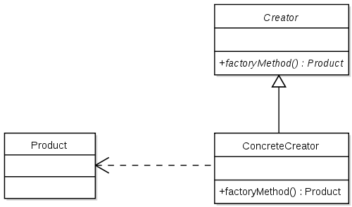

# Factory-Pattern
Define an interface for creating an object, but let subclasses decide which class to instantiate.   
Factory Method lets a class defer instantiation to subclasses.  

In Factory Method, client knows about abstract base class but not concrete subclass. Client wants to create an object from abstract class. But the subclass decides which class to instantiate. This allows us to defer the creation to the subclass. Again, the client doesn't know which subclass or concrete class is used to create the object. The creation is deferred to run-time.

# Diagram

# Pros
 1) You avoid tight coupling between the creator and the concrete products.
 2) Single Responsibility Principle. You can move the product creation code into one place in the program, making the code easier to support.
 3) Open/Closed Principle. You can introduce new types of products into the program without breaking existing client code.
 
 # Cons
 The code may become more complicated since you need to introduce a lot of new subclasses to implement the pattern. The best case scenario is when you’re introducing the pattern into an existing hierarchy of creator classes.